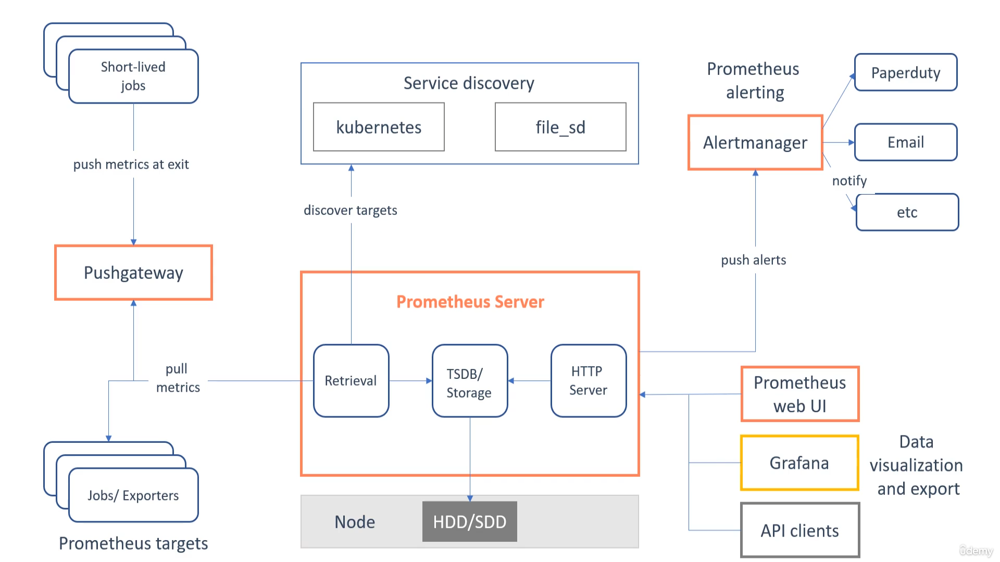

# Prometheus Resources

## Prometheus Course

https://www.udemy.com/course/prometheus-course/

### Terms

- Monitoring: a systematic process of collecting and recording the activities taking place in a target project, programme or service and then using those recorded values to check if the targets are reaching their objectives or not

- Alert/Alerting: an alert is the outcome of an alerting rule in Prometheus that is actively firing. Alerts are sent from Prometheus to the Alertmanager.

- Alertmanager: The Alertmanager takes in alerts from Prometheus server, aggregates them into groups, de-duplicates, applies silences, throttles, and then sends out notifications to email, Pagerduty, Slack, etc.

- Target: A target is the definition of an object to scrape. Target is an object whose metrics are to be monitored.

- Instance: An endpoint you can scrape is called an instance in Prometheus

- Job: A collection of targets/instances with the same purpose

- Sample: a single value at a point in time in a time series

### Prometheus Architecture

## Other Links

https://prometheus.io/

https://grafana.com/

https://github.com/prometheus/node_exporter

https://github.com/samber/awesome-prometheus-alerts

https://www.youtube.com/watch?v=9TJx7QTrTyo

<iframe width="560" height="315" src="https://www.youtube.com/embed/9TJx7QTrTyo?si=TlIyZggdlfOaIQtQ" title="YouTube video player" frameborder="0" allow="accelerometer; autoplay; clipboard-write; encrypted-media; gyroscope; picture-in-picture; web-share" referrerpolicy="strict-origin-when-cross-origin" allowfullscreen></iframe>
